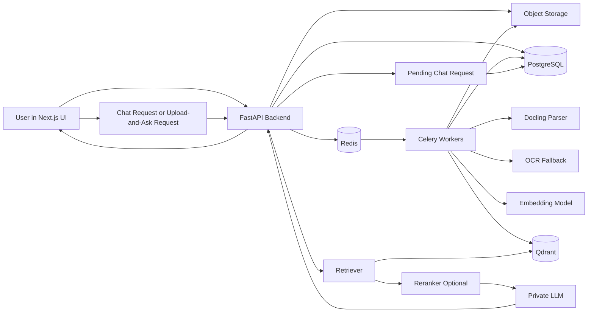
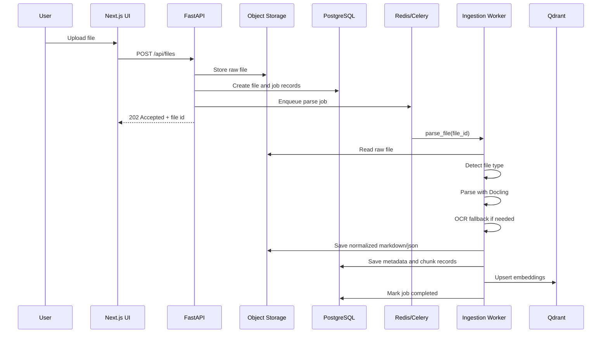
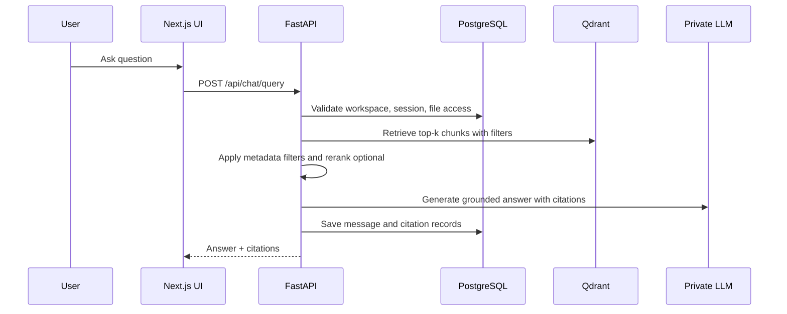
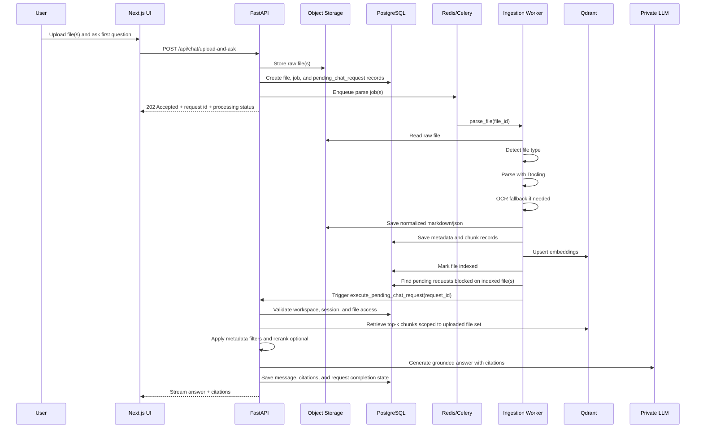

# Private LLM Document Workspace - Reference Architecture and Product Requirements Document

## 1. Document Purpose

This document defines the reference architecture and build requirements for a private LLM application that can ingest, index, and answer questions over common desktop documents inside a controlled environment.

The target implementation is:
- **Frontend:** Next.js (TypeScript)
- **Backend APIs and ingestion:** Python
- **Document parsing:** Python-first packages
- **Retrieval:** local/private embeddings + vector search
- **LLM inference:** local or privately hosted

This PRD is written for junior engineers. It is intentionally explicit.

---

## 2. Product Summary

Build a private document-aware chat application where users can:
- upload common business files
- have those files parsed and indexed asynchronously
- search and chat with grounded answers from only their authorized documents
- view citations back to the source file and page or sheet when possible
- operate in a private deployment without sending data to third-party LLM SaaS by default

The system must support at minimum:
- PDF
- DOCX
- XLSX
- CSV
- PNG
- JPEG
- TXT
- Markdown
- PPTX (recommended even if not day-1 critical)

---

## 3. Goals

### 3.1 Core goals

1. Support private ingestion of common desktop files.
2. Convert uploaded files into normalized text plus structured metadata.
3. Chunk and embed content for retrieval.
4. Ground LLM responses only on retrieved enterprise content.
5. Show citations that point back to source documents.
6. Keep the architecture modular so parsers, embeddings, vector store, and LLM can be swapped.
7. Make the system straightforward for junior engineers to build, test, and maintain.

### 3.2 Non-goals for v1

1. Real-time collaborative document editing.
2. Fine-tuning LLMs on customer data.
3. Full enterprise IAM federation beyond basic SSO-ready hooks.
4. Advanced workflow automation agents.
5. Audio and video ingestion.
6. Email, SharePoint, or Google Drive connectors in v1 unless explicitly added later.

---

## 4. Users and Main Use Cases

### 4.1 User types

- **Admin**: manages workspaces, models, and settings.
- **Knowledge user**: uploads files, chats with documents, inspects citations.
- **Auditor/compliance user**: reviews what file was used, when it was ingested, and which chunks supported an answer.

### 4.2 Primary use cases

1. User uploads a PDF, DOCX, XLSX, or image.
2. System parses the file and stores normalized content.
3. System creates embeddings and indexes chunks.
4. User asks a question.
5. System retrieves relevant chunks.
6. System prompts the LLM with only authorized context.
7. UI shows answer plus citations.

### 4.3 Upload-and-ask user experience

The product must also support a ChatGPT-style upload-and-ask flow without weakening enterprise controls.

In this mode:
1. User uploads one or more files and types the first question in the same UI action.
2. System stores the file and creates a pending chat request.
3. System runs the normal ingestion and indexing pipeline.
4. Once the uploaded file is indexed, system automatically executes the saved question through the grounded retrieval path.
5. UI shows answer plus citations, scoped to the uploaded file set by default.

Important rule: upload-and-ask is an orchestration layer over the same grounded retrieval architecture. It is not a bypass that sends raw uploaded file bodies directly to the LLM.

---

## 5. Recommended Technology Choices

## 5.1 Frontend

- **Next.js** (App Router, TypeScript)
- **Tailwind CSS**
- **shadcn/ui** for UI primitives
- **React Query / TanStack Query** for API state
- **react-dropzone** for uploads
- **Zustand** or built-in React state for lightweight local state

## 5.2 Backend API

- **FastAPI**
- **Pydantic** for request/response models
- **SQLAlchemy** for ORM
- **Alembic** for migrations
- **Uvicorn** for local serving

## 5.3 Async jobs

- **Celery** workers
- **Redis** as broker/result backend

Why: ingestion and embedding should not block the upload request. Celery is built for distributed task queues, and Redis is a common supported broker choice.

## 5.4 Document parsing and normalization

### Primary parser
- **Docling** as the main conversion layer

Why Docling:
- supports PDF, DOCX, XLSX, PPTX, CSV, PNG, JPEG, HTML, Markdown, and more
- exports normalized **Markdown** and **JSON**
- handles advanced PDF understanding such as layout and tables

### Fallback / specialist parsers
- **pandas** for CSV normalization
- **openpyxl** for spreadsheet-aware Excel extraction
- **Pillow** for image preprocessing
- **python-magic** or file signature detection to validate file type

### OCR fallback for scans/images
- **PaddleOCR** as preferred OCR fallback for difficult scans and images
- **Tesseract** as optional simpler fallback where operational simplicity matters more than layout quality

## 5.5 Embeddings and reranking

- **sentence-transformers** for local embedding models
- optional reranker via **sentence-transformers CrossEncoder**

## 5.6 Vector store

### Recommended default
- **Qdrant**

Why:
- good support for metadata filtering
- mature Python client
- straightforward local/private deployment
- easy operational separation from the transactional database

### Acceptable alternative
- **PostgreSQL + pgvector**

Use pgvector only if the team strongly prefers a single-database footprint in v1 and accepts lower specialization on vector operations.

## 5.7 Transactional database

- **PostgreSQL**

Use PostgreSQL for:
- users
- workspaces
- files
- ingestion job states
- document metadata
- chat sessions
- citations
- audit logs

## 5.8 Object storage

- **S3-compatible object store**
- MinIO for local/private deployments is acceptable

Use object storage for:
- raw uploaded files
- rendered page images when needed
- normalized markdown/json artifacts
- debug artifacts from failed ingestion jobs

## 5.9 LLM serving

### Recommended v1 options
- **Ollama** for easiest local developer experience
- **vLLM** for more scalable private inference later

The PRD assumes the LLM is reachable through an internal API and can be swapped without changing the rest of the application.

---

## 6. Why these package choices

1. **Docling** reduces custom parser sprawl by covering the most important file types in one Python-oriented conversion layer.
2. **FastAPI + Celery + Redis** keeps the backend understandable and production-friendly.
3. **Qdrant** cleanly separates vector retrieval from transactional concerns.
4. **PostgreSQL** remains the source of truth for application state.
5. **sentence-transformers** allows fully local embedding generation.
6. **PaddleOCR** gives us a stronger fallback for image-heavy and scanned documents.

---

## 7. Reference Architecture

## 7.1 Logical components

1. **Next.js Web App**
   - authentication
   - file upload UI
   - document library UI
   - chat UI
   - citations panel
   - admin settings UI

2. **API Gateway / App Backend (FastAPI)**
   - auth/session validation
   - upload endpoint
   - document listing endpoints
   - chat/query endpoints
   - citation endpoints
   - admin/config endpoints

3. **Job Workers (Celery)**
   - parse jobs
   - OCR fallback jobs
   - chunking jobs
   - embedding jobs
   - reindex/reprocess jobs

4. **Storage Layer**
   - object storage for files and normalized artifacts
   - PostgreSQL for metadata and app state
   - Qdrant for vector search
   - Redis for queueing

5. **Model Layer**
   - embedding model service
   - reranker service (optional)
   - LLM inference service

## 7.2 Data flow



## 7.3 End-to-end ingestion sequence



## 7.4 End-to-end grounded query sequence



## 7.5 End-to-end upload-and-ask sequence



---

## 8. Parsing Strategy by File Type

## 8.1 PDF

### Native text PDF
- Parse with Docling first.
- Preserve page numbers, headings, paragraphs, tables, and figure markers where possible.
- Save normalized Markdown and lossless JSON artifacts.

### Scanned PDF
- Run Docling first.
- If extracted text density is too low, trigger OCR fallback.
- OCR fallback should output page-aware text blocks.

### Acceptance criteria
- Page references available.
- Tables not flattened into unreadable text where avoidable.
- Low-text scan detection works reliably enough to trigger OCR fallback.

## 8.2 DOCX

- Parse with Docling first.
- Preserve heading hierarchy, lists, tables, and paragraph blocks.
- Save section markers for citation granularity when page numbers are unavailable.

## 8.3 XLSX / Excel

- Use Docling first for broad ingestion.
- For spreadsheets that require sheet-aware extraction or better table fidelity, also support a structured fallback path using **openpyxl**.
- Treat each worksheet as a logical sub-document.
- Keep sheet name, table range, row numbers, and column headers in metadata.
- Generate both:
  - narrative text representation for retrieval
  - structured JSON snapshot for future table QA features

Example chunk text for a sheet:

```text
Sheet: Revenue Forecast
Table: A1:G40
Headers: Month, Region, Revenue, Cost, Margin
Row 12: Jan, East, 150000, 120000, 30000
```

## 8.4 CSV

- Parse with pandas.
- Infer delimiter, headers, row count, and column dtypes.
- If file is large, chunk by row groups while repeating headers in metadata.

## 8.5 PNG / JPEG

- Use Docling if it can produce acceptable extraction.
- If extraction confidence or text density is poor, use PaddleOCR fallback.
- Store original image plus OCR text blocks.
- Keep bounding box metadata if available for future UX enhancements.

## 8.6 TXT / MD / HTML

- Normalize encoding to UTF-8.
- Remove boilerplate when obvious.
- Chunk by heading and paragraph boundaries.

## 8.7 PPTX (recommended)

- Parse with Docling.
- Treat each slide as a page-like unit.
- Store slide number in metadata.

---

## 9. Chunking Strategy

## 9.1 Rules

Chunking must preserve meaning and traceability.

Use a hierarchical strategy:
1. split by file structure first
2. split by headings or page/sheet boundaries second
3. split by token budget last

## 9.2 Default chunk targets

- target size: 500 to 900 tokens
- overlap: 80 to 120 tokens
- never merge content across different pages or sheets unless explicitly configured

## 9.3 Chunk metadata

Every chunk must include:
- chunk_id
- file_id
- workspace_id
- source_type
- page_number if available
- sheet_name if available
- section_heading if available
- chunk_index
- token_count
- parser_used
- OCR_used true/false
- content_hash

---

## 10. Retrieval Strategy

## 10.1 Baseline retrieval

1. Embed the user question.
2. Retrieve top-k vector matches from Qdrant.
3. Filter by workspace and user authorization.
4. Optional keyword or metadata filter.
5. Optional rerank the top 20 to 50 chunks.
6. Select final context window.
7. Build prompt with citation tags.

## 10.2 Retrieval defaults

- initial top-k: 20
- rerank top-n: 25
- final context chunks: 6 to 10

## 10.3 Grounding rules

- The answer must cite chunk sources.
- If retrieval confidence is weak, the model should say it does not have enough grounded context.
- Do not let the system answer from general model knowledge when the UI is in document-grounded mode unless the product explicitly exposes that mode.

## 10.4 Upload-and-ask retrieval rules

- The default retrieval scope for upload-and-ask must be the uploaded file set only.
- The system may allow the user to expand search to the rest of the workspace later, but only through an explicit user action.
- The first answer in upload-and-ask mode must be generated through the same retrieval, reranking, and citation path as a normal grounded query.
- Raw uploaded file bodies must not be sent directly to the LLM in grounded mode.

---

## 11. Security and Privacy Requirements

## 11.1 Data handling

- All uploaded files stay inside private infrastructure.
- No document content is sent to external SaaS LLMs by default.
- Embeddings are generated locally or in a private inference environment.
- Logs must not contain raw document bodies except in restricted debug mode.
- In grounded mode, raw uploaded file bodies must not be passed directly to the LLM. The LLM must receive only retrieved and authorized context chunks.

## 11.2 Access control

- Every file belongs to a workspace.
- Every retrieval request is filtered by workspace and user authorization.
- Users cannot retrieve chunks from workspaces they do not belong to.
- Upload-and-ask requests must not execute until uploaded files are associated with the correct workspace and authorization metadata.

## 11.3 Retention and deletion

Deleting a file must delete or tombstone:
- raw object from storage
- normalized markdown/json artifacts
- chunk rows in PostgreSQL if stored there
- vectors in Qdrant
- citation references if necessary
- unresolved pending chat requests that can no longer execute against the deleted file

## 11.4 Auditability

Store audit records for:
- file uploaded
- file parsed
- OCR fallback invoked
- embeddings generated
- chat query executed
- chunks retrieved
- answer generated
- upload_and_ask_requested
- upload_and_ask_waiting_for_index
- upload_and_ask_executed
- upload_and_ask_completed
- upload_and_ask_failed

---

## 12. Functional Requirements

## 12.1 Authentication

### Must have
- basic email/password or SSO-ready auth layer
- workspace membership model
- protected routes in Next.js

### Nice to have
- OIDC/SAML later

## 12.2 File upload

### Must have
- drag-and-drop upload
- multi-file upload
- max file size configurable
- file type validation by extension and signature
- upload progress
- ingestion status badges

### Status values
- uploaded
- queued
- parsing
- OCR_fallback
- chunking
- embedding
- indexed
- failed

## 12.3 Document library

### Must have
- list files by workspace
- filter by status, type, owner, upload date
- reprocess file
- delete file
- view ingestion logs

## 12.4 Chat with documents

### Must have
- chat within a workspace
- answer with citations
- show supporting chunks in expandable panel
- stream answer tokens to UI
- upload-and-ask flow that accepts file(s) plus first question in one UI action
- status states for upload-and-ask such as uploading, indexing, retrieving, generating, completed, failed

### Nice to have
- choose collection or subset of files
- answer mode: concise, normal, detailed
- explicit toggle to expand scope from uploaded files only to the full workspace

## 12.5 Citation UX

### Must have
- file name
- page number or sheet name where available
- chunk preview snippet

### Nice to have
- highlight source text in viewer

## 12.6 Admin settings

### Must have
- configure parser settings
- configure chunk size and overlap
- configure embedding model
- configure LLM endpoint
- configure vector store connection

---

## 13. Non-Functional Requirements

## 13.1 Performance

- Upload API should return quickly after storing the file and enqueueing work.
- A normal 10 to 20 page PDF should ingest within a reasonable target window in a local environment.
- Query response should start streaming quickly after retrieval.

## 13.2 Reliability

- Failed jobs must be retryable.
- Workers must be idempotent where possible.
- Reprocessing a file must replace prior chunks and vectors cleanly.

## 13.3 Scalability

- Scale Next.js separately from Python workers.
- Scale vector DB separately from PostgreSQL.
- Add more Celery workers for ingestion bursts.

## 13.4 Observability

- structured logs
- ingestion job traces
- per-stage timing metrics
- retrieval metrics
- answer provenance logs

---

## 14. Proposed Data Model

## 14.1 PostgreSQL tables

### users
- id
- email
- name
- password_hash or auth_provider fields
- created_at

### workspaces
- id
- name
- created_by
- created_at

### workspace_members
- id
- workspace_id
- user_id
- role

### files
- id
- workspace_id
- uploaded_by
- original_filename
- storage_key
- mime_type
- file_size_bytes
- sha256
- status
- parser_used
- OCR_used
- uploaded_at
- indexed_at

### ingestion_jobs
- id
- file_id
- job_type
- status
- attempt_count
- error_message
- started_at
- finished_at

### documents
- id
- file_id
- logical_name
- source_type
- page_count nullable
- sheet_count nullable
- normalized_markdown_key
- normalized_json_key

### chunks
- id
- file_id
- document_id
- chunk_index
- page_number nullable
- sheet_name nullable
- section_heading nullable
- text_content
- token_count
- metadata_json
- content_hash

### chat_sessions
- id
- workspace_id
- created_by
- title
- created_at

### chat_messages
- id
- session_id
- role
- content
- created_at

### pending_chat_requests
- id
- workspace_id
- session_id
- created_by
- question
- mode
- scope
- status
- file_selection_json
- error_message nullable
- created_at
- started_at nullable
- finished_at nullable

### citations
- id
- message_id
- file_id
- chunk_id
- rank
- score
- display_label

### message_scopes
- id
- message_id
- scope_type
- scope_file_ids_json

### audit_events
- id
- actor_user_id nullable
- workspace_id nullable
- entity_type
- entity_id
- action
- metadata_json
- created_at

---

## 15. Vector Schema

## 15.1 Qdrant collection payload

Each vector payload should include:
- chunk_id
- file_id
- workspace_id
- source_type
- page_number
- sheet_name
- section_heading
- uploaded_by
- parser_used
- OCR_used
- content_hash

## 15.2 Collection strategy

Use one collection per environment at first with payload filters on workspace_id.

Alternative later:
- one collection per workspace if strict isolation or very large scale requires it

---

## 16. API Design

## 16.1 Upload APIs

### POST /api/files
Upload one or more files.

Response:
```json
{
  "files": [
    {
      "id": "file_123",
      "status": "queued"
    }
  ]
}
```

### GET /api/files
List files in workspace.

### GET /api/files/{fileId}
Get file metadata and ingestion status.

### POST /api/files/{fileId}/reprocess
Re-run parsing and indexing.

### DELETE /api/files/{fileId}
Delete file and associated vectors/artifacts.

## 16.2 Chat APIs

### POST /api/chat/query
Request body:
```json
{
  "workspaceId": "ws_123",
  "sessionId": "sess_123",
  "question": "What does the contract say about payment terms?",
  "fileIds": ["file_123", "file_456"],
  "mode": "grounded"
}
```

Parameter meanings:
- `workspaceId`: workspace boundary for authorization and retrieval
- `sessionId`: chat thread to continue and persist the answer into
- `question`: user question text
- `fileIds`: optional retrieval scope limiter for exact file selection
- `mode`: answer policy; `grounded` means answer from retrieved enterprise context only

Response shape:
```json
{
  "answer": "...",
  "citations": [
    {
      "fileId": "file_123",
      "fileName": "vendor_contract.pdf",
      "page": 8,
      "snippet": "Net 30 days from invoice receipt..."
    }
  ]
}
```

### POST /api/chat/upload-and-ask
Purpose: accept file upload plus first question in one request while preserving the normal grounded retrieval path.

Request body shape:
```json
{
  "workspaceId": "ws_123",
  "sessionId": "sess_123",
  "question": "Summarize the payment terms in this contract",
  "mode": "grounded",
  "scope": "uploaded_files_only"
}
```

Multipart file payload or upload token(s) are sent with the same request.

Response shape:
```json
{
  "requestId": "uar_123",
  "sessionId": "sess_123",
  "files": [
    {
      "id": "file_123",
      "status": "queued"
    }
  ],
  "status": "waiting_for_index"
}
```

### GET /api/chat/upload-and-ask/{requestId}
Purpose: poll request state if the UI is not using server-sent events or websockets.

Response shape:
```json
{
  "requestId": "uar_123",
  "status": "executing",
  "fileStatuses": [
    {
      "fileId": "file_123",
      "status": "indexed"
    }
  ],
  "answerReady": false
}
```

### GET /api/chat/sessions
### GET /api/chat/sessions/{sessionId}
### POST /api/chat/sessions

## 16.3 Admin APIs

### GET /api/admin/settings
### PUT /api/admin/settings
### GET /api/admin/jobs

---

## 17. Worker Design

## 17.1 Job types

1. `parse_file`
2. `ocr_fallback`
3. `normalize_document`
4. `chunk_document`
5. `embed_chunks`
6. `index_vectors`
7. `delete_vectors`
8. `reprocess_file`
9. `execute_pending_chat_request`

## 17.2 Job orchestration

Preferred sequence:
- parse_file
- if low text density then ocr_fallback
- normalize_document
- chunk_document
- embed_chunks
- index_vectors
- finalize_status
- if pending request exists for indexed file set then execute_pending_chat_request

## 17.3 Failure handling

- Retry transient failures.
- Mark permanent failures as `failed`.
- Save debug artifact paths and error messages.
- Surface the failure reason to the UI.
- If upload-and-ask ingestion fails, mark the pending request as `failed` and do not generate an ungrounded fallback answer.

---

## 18. File Type Detection and Validation

Do not trust only the filename extension.

### Requirements
- validate size limits
- validate content type header
- validate file signature where possible
- reject encrypted/password-protected files in v1 with a clear error
- quarantine files that fail validation

---

## 19. Prompt Construction Requirements

## 19.1 System prompt behavior

The grounded chat system prompt must instruct the model to:
- answer only from provided context
- cite sources when making claims
- say when the answer is not supported by retrieved context
- avoid inventing page numbers or facts

## 19.2 Context format

Recommended format:

```text
[Source 1 | file=vendor_contract.pdf | page=8 | chunk=12]
...chunk text...

[Source 2 | file=pricing_sheet.xlsx | sheet=Summary | chunk=4]
...chunk text...
```

## 19.3 Upload-and-ask prompt requirement

For upload-and-ask, the prompt assembly path must be identical to normal grounded chat after indexing completes. The system must not create a separate raw-file prompt path for the first answer.

---

## 20. Suggested Repository Layout

```text
repo/
  apps/
    web/                       # Next.js app
  services/
    api/                       # FastAPI app
    workers/                   # Celery workers
  packages/
    shared-types/              # TS shared schemas if desired
  infra/
    docker/
    k8s/
    terraform/
  docs/
    architecture/
    ADRs/
```

### Example backend layout

```text
services/api/
  app/
    main.py
    api/
      routes_files.py
      routes_chat.py
      routes_admin.py
    core/
      config.py
      security.py
      logging.py
    db/
      models.py
      session.py
      migrations/
    services/
      storage_service.py
      parser_service.py
      chunking_service.py
      embedding_service.py
      retrieval_service.py
      llm_service.py
    schemas/
    utils/
```

---

## 21. Package Recommendations

## 21.1 Frontend package list

```bash
npm install next react react-dom typescript
npm install @tanstack/react-query zustand react-dropzone zod
npm install tailwindcss class-variance-authority clsx lucide-react
npm install sonner
```

Optional:
```bash
npm install @microsoft/fetch-event-source
```

Use for streaming chat responses if not using native EventSource patterns.

## 21.2 Backend package list

```bash
pip install fastapi uvicorn pydantic sqlalchemy alembic psycopg[binary]
pip install celery redis python-multipart httpx
pip install qdrant-client sentence-transformers
pip install docling pandas openpyxl pillow python-magic
pip install structlog tenacity orjson tiktoken
```

Optional OCR packages:
```bash
pip install paddleocr
pip install pytesseract
```

Optional model serving or inference clients:
```bash
pip install ollama
```

Notes:
- `python-multipart` is needed for FastAPI file uploads.
- `tiktoken` is useful for chunk sizing by approximate token count.
- `tenacity` helps with retries around model and storage calls.

---

## 22. Configuration Requirements

Environment variables should include at least:

```env
APP_ENV=local
DATABASE_URL=postgresql+psycopg://...
REDIS_URL=redis://...
S3_ENDPOINT=http://minio:9000
S3_BUCKET=private-llm
S3_ACCESS_KEY=...
S3_SECRET_KEY=...
QDRANT_URL=http://qdrant:6333
EMBEDDING_MODEL_NAME=local-embedding-model
LLM_BASE_URL=http://ollama:11434
LLM_MODEL_NAME=your-llm-model
MAX_FILE_SIZE_MB=50
DEFAULT_CHUNK_SIZE=700
DEFAULT_CHUNK_OVERLAP=100
```

---

## 23. UX Requirements for Next.js App

## 23.1 Pages

### Login page
- auth form
- clean error states

### Workspace dashboard
- workspace selector
- recent files
- ingestion status summary
- recent chats

### Document library page
- upload control
- table of files
- filters
- file detail drawer

### Chat page
- chat thread
- streaming response
- citation sidebar
- source chunk preview drawer

### Admin page
- model config
- parser config
- worker/job visibility

## 23.2 UX behaviors

- optimistic upload row creation after enqueue
- polling or SSE for ingestion status
- disable chat on files not fully indexed if file-scoped mode is chosen
- clear retry button on failed files

---

## 24. Testing Requirements

## 24.1 Unit tests

Required for:
- file type detection
- parser selection logic
- text density heuristic for OCR fallback
- chunking rules
- metadata generation
- prompt builder
- citation formatting

## 24.2 Integration tests

Required for:
- upload -> parse -> embed -> index flow
- query -> retrieve -> answer flow
- delete -> vector removal flow
- reprocess -> replacement indexing flow

## 24.3 Golden test corpus

Create a fixture set containing:
- native text PDF
- scanned PDF
- DOCX with headings and table
- XLSX with multiple sheets
- CSV with 50k rows sample subset
- PNG screenshot with text
- JPEG invoice or form

Expected output should verify:
- parser selected
- OCR fallback triggered when appropriate
- metadata captured correctly
- citations point to correct source units

---

## 25. Observability Requirements

Metrics to capture:
- uploads per day
- parse success rate
- OCR fallback rate
- average parse duration by file type
- average embedding duration
- average retrieval latency
- average answer latency
- percentage of answers with citations
- failed job counts by stage

Logs must include:
- request id
- workspace id
- file id
- job id
- parser used
- stage name
- duration ms

---

## 26. Delivery Plan

## Phase 1 - MVP

Build:
- auth
- workspace model
- file upload
- Docling parsing
- Qdrant indexing
- local embeddings
- grounded chat with citations
- upload-and-ask orchestration over the same grounded retrieval path
- delete and reprocess

Supported file types day 1:
- PDF
- DOCX
- XLSX
- CSV
- PNG
- JPEG
- TXT

## Phase 2 - Hardening

Build:
- OCR fallback quality improvements
- reranker
- admin config page
- richer citations
- per-file retrieval filters
- better ingestion logs

## Phase 3 - Enterprise readiness

Build:
- SSO
- RBAC hardening
- audit export
- background reindexing
- connector framework
- document viewer with highlight

---

## 27. Acceptance Criteria

A build is acceptable when all of the following are true:

1. User can upload PDF, DOCX, XLSX, CSV, PNG, and JPEG from the Next.js UI.
2. Upload returns quickly and processing happens asynchronously.
3. Files move through visible ingestion states.
4. Parsed documents are normalized and chunked.
5. Chunks are embedded and searchable.
6. Chat answers use retrieved context and display citations.
7. Users cannot query files outside their workspace.
8. Reprocess replaces stale vectors cleanly.
9. Delete removes document artifacts and vectors.
10. Errors are visible and retryable.
11. Upload-and-ask accepts file(s) plus first question in one action and returns a pending request state quickly.
12. The first upload-and-ask answer is generated only after indexing completes and uses the same grounded retrieval path as standard chat.
13. Upload-and-ask defaults retrieval scope to the uploaded file set unless the user explicitly broadens scope.

---

## 28. Engineering Decisions to Lock Early

The tech lead should lock these decisions before implementation starts:

1. **Vector store:** Qdrant or pgvector.
2. **OCR policy:** Docling-only first, or Docling + PaddleOCR fallback from day 1.
3. **Auth approach:** local auth, Clerk/Auth.js, or enterprise SSO adapter.
4. **Object store:** local MinIO or managed S3-compatible storage.
5. **LLM serving:** Ollama for MVP or vLLM if GPU infra already exists.
6. **Embedding model:** one default local model and one larger optional model.

---

## 29. Practical Implementation Notes for Junior Engineers

1. Start with the happy path for PDF and DOCX first.
2. Do not mix upload logic with parsing logic in the API request thread.
3. Keep chunk metadata rich from the beginning. You will need it later.
4. Build deletion correctly early; stale vectors create confusing bugs.
5. Add deterministic test fixtures before optimizing performance.
6. Do not overcomplicate retrieval in v1. Simple vector retrieval plus clean metadata is enough to start.
7. Treat Excel separately from normal text documents. Spreadsheet retrieval needs structure awareness.
8. Make every job idempotent when possible. Re-running jobs should not duplicate chunks or vectors.
9. Do not implement upload-and-ask as a raw attachment shortcut to the LLM. Treat it as orchestration over the same grounded retrieval system.

---

## 30. Recommended Default Decision Set

If no architect overrides the defaults, build with this stack:

- **Frontend:** Next.js + TypeScript + Tailwind + shadcn/ui
- **Backend:** FastAPI + SQLAlchemy + Alembic
- **Workers:** Celery + Redis
- **Transactional DB:** PostgreSQL
- **Vector DB:** Qdrant
- **Object storage:** MinIO
- **Primary parser:** Docling
- **Spreadsheet fallback:** openpyxl + pandas
- **OCR fallback:** PaddleOCR
- **Embeddings:** sentence-transformers
- **LLM runtime:** Ollama for local MVP

This is the most balanced v1 choice for a private, Python-friendly, document-grounded system.

---

## 31. Source Notes for Package Selection

The package recommendations in this PRD are based on current official documentation showing:
- **Docling** supports PDF, DOCX, XLSX, PPTX, CSV, PNG, and JPEG and can export Markdown/JSON.
- **FastAPI** supports file uploads and background task patterns.
- **Celery** is a distributed task queue commonly paired with Redis.
- **Qdrant** provides vector search with payload filtering and a Python client.
- **pgvector** adds vector similarity search to PostgreSQL with HNSW and IVFFlat indexing options.
- **sentence-transformers** supports local embedding and reranker models.
- **PaddleOCR** and **Tesseract** are viable OCR options for image/scanned documents.

